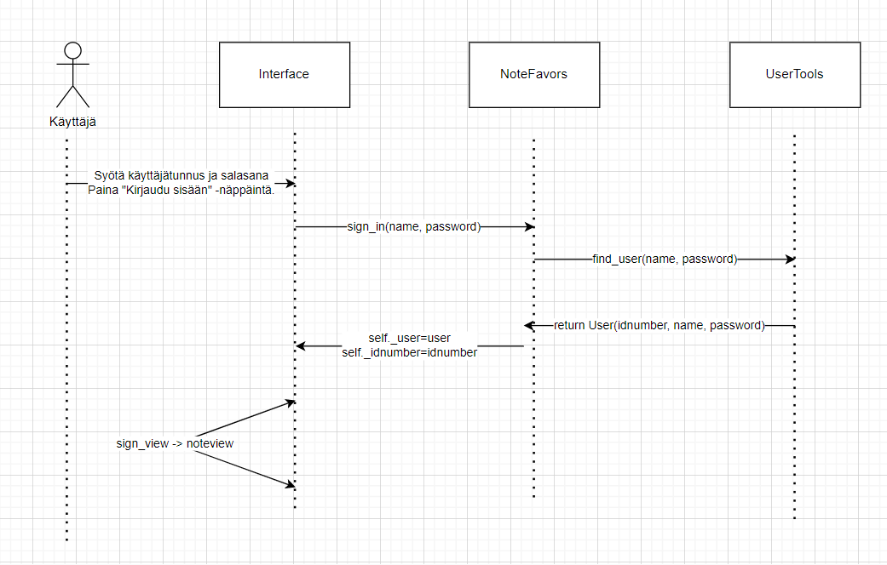
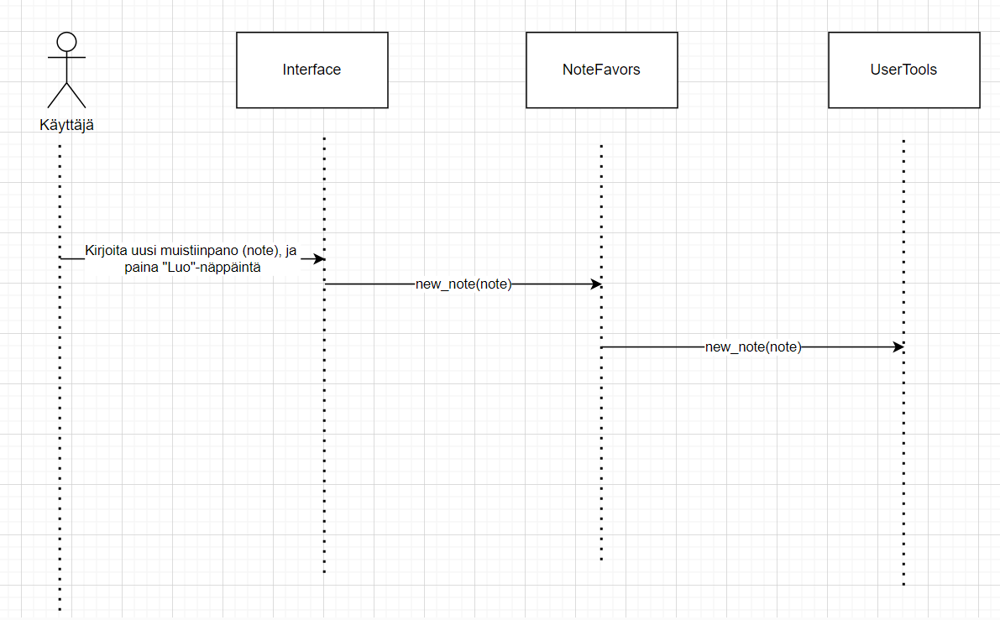

# Arkkitehtuuri

### Pakkauskaavio

Ohjelman pakkauskaavio on seuraavanlainen:

Tässä Screen vastaa käyttöliittymästä, Services sovelluslogiikasta, Repositories tietokannan muokkauksesta ja Entities olioiden luomisesta.

### Käyttöliittymä

Käyttöliittymässä on kolme näkymää: kirjautumisnäkymä, rekisteröintinäkymä ja muistiinpanonäkymä.
Näkymien vaihtamisesta vastaa Interface-luokka. Käyttöliittymä kutsuu sovelluslogiikan luokkaa NoteFavors toimintojen tekemiseen.

## Tietojen tallentaminen

Sovelluksen tiedot tallennetaan tietokantaan. Tietokantatiedoston nimi on muistio.db.
NoteTools ja UserTools -nimiset luokat huolehtivat tiedon tallentamisesta ja tiedon hakemisesta.
Tietokannassa on taulut Users ja Notes, eli käyttäjät ja muistiinpanot ovat eri tauluissa.

#### Rekisteröinti

Sekvenssikaavio kuvaa rekisteröintiä:

#### Kirjautuminen

Kirjautumisessa syötetään salasana, ja sovellus toimii seuraavasti:

#### Muistiinpanojen luonti

Uuden muistiinpanon luontia kuvataan tässä kaaviossa:

