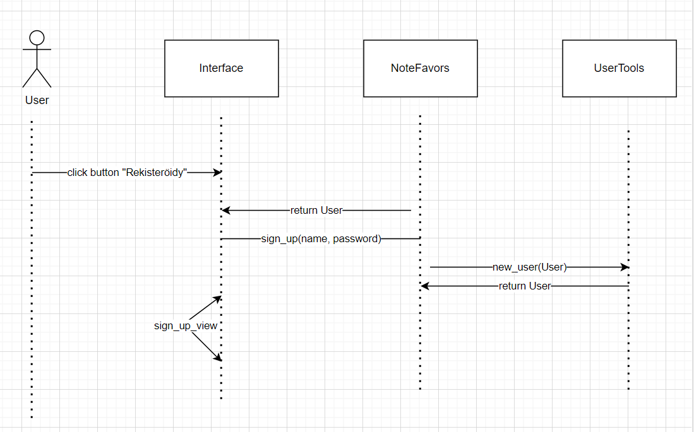

# Arkkitehtuuri

### Pakkauskaavio

Ohjelman pakkauskaavio on seuraavanlainen:

Tässä Screen vastaa käyttöliittymästä, Services sovelluslogiikasta, Repositories tietokannan muokkauksesta ja Entities olioiden luomisesta.

### Sekvenssikaavio

Sekvenssikaavio kuvaa rekisteröintiä:

### Käyttöliittymä

Sovelluksen käynnistyessä ensin ilmestyy kirjautumisnäkymä. Muut näkymät ovat rekisteröintinäkymä ja Muistiinpanonäkymä.

