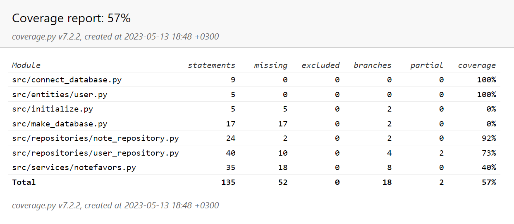

## Testausdokumentti

Ohjelmaa testataan unittest-testien avulla. Testit keskittyvät note- ja user-repository-luokkiin.

### Testaus

- Repositorio-luokkia testataan tyhjentämällä ensin tietokantatiedosto, ja testaamalla sitten toimintoja.
- Luokat TestNoteTools ja TestUserTools testaavat repositorio-luokkia.
- Sovelluslogiikan testaamiseen on luotu omat repositorioluokat: FakeNoteRepository ja FakeUserRepository

### Testauskattavuus

Testauskattavuus on 57 prosenttia. Testaamatta on jäänyt muun muassa tietokantataulujen luominen.

### Sovelluksen laatuongelmat ja virheet

- Muistiinpanojen palauttamisessa on ongelmia: ohjelma ei tällä hetkellä palauta muistiinpanoja.
- Virheviestit eivät tulostu ohjelmaan vaan terminaaliin
